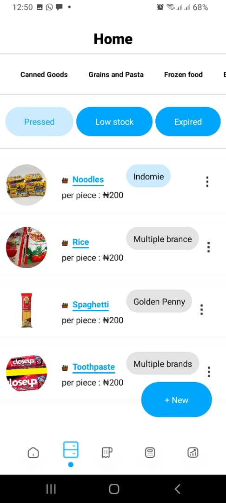

# SpinGo Internship Coding Challenge

## Project Description

This project is a solution for the SpinGo React Native Internship coding challenge. The task was to implement the UI of two screens from a provided Figma design using React Native and TypeScript.

## Figma Design

The Figma design for the task can be found [here](https://www.figma.com/design/4ffOJ5vgOsAXNENEPHt1TI/SpinGo-Internship?node-id=0-1&t=U7PDNFBcoSy8cDZj-0).

## Technologies Used

- **React Native**: 0.74.3
- **TypeScript**: 5.1.3
- **Expo**: 51.0.21
- **React Navigation**: 6.1.18
- **React Navigation Native Stack**: 6.10.1
- **Expo App Loading**: 2.1.1
- **Expo Font**: 12.0.9
- **Expo Linear Gradient**: 13.0.2
- **Expo Splash Screen**: 0.27.5
- **Expo Status Bar**: 1.12.1
- **React Native Safe Area Context**: 4.10.8
- **React Native Screens**: 3.32.0
- **React Native SVG**: 15.2.0
- **React Native SVG Transformer**: 1.5.0

## Installation and Setup

1. **Clone the repository**

   ```bash
   git clone [https://github.com/victot0121/SpinGoReactNativeChallenge.git]
   ```

2. **Navigate to the project directory**

   ```bash
   cd [spainGoReactNativeChallenge]
   ```

3. **Install dependencies**

   ```bash
   npm install
   ```

4. **Start the project**
   ```bash
   npx expo start
   ```

## Screenshots

### Screen 1


### Screen 2



### Screen 3


## How to Run the Project

To run this project, you need to have Expo CLI installed on your machine. If you don't have it installed, you can install it globally using npm:

```bash
npm install -g expo-cli
```
